# EcoChef — Sistem Diyagramları

> Yapay Zeka Destekli Akıllı Mutfak Asistanı  
> FastAPI Backend + React Native (Expo) Mobile + Docker + MySQL

---

## 1. Genel Sistem Mimarisi

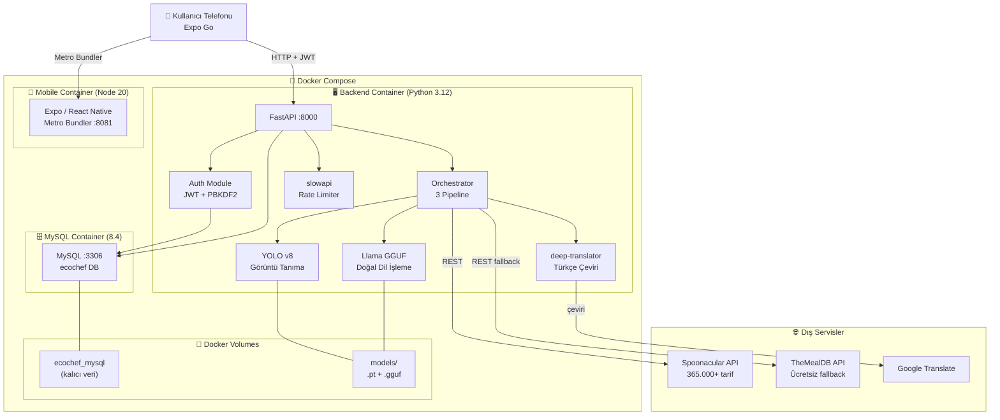

---

## 2. Pipeline Akış Diyagramları

### 2a. Görsel Analiz Pipeline (Pipeline 1)

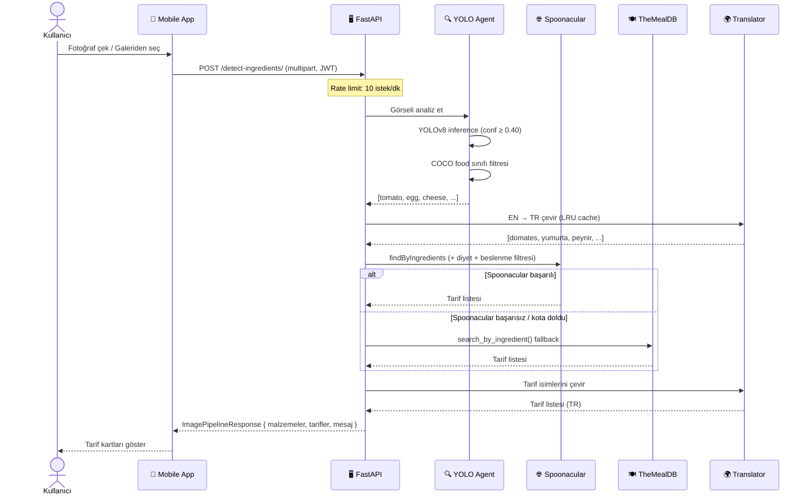

### 2b. Metin Analizi Pipeline (Pipeline 2)

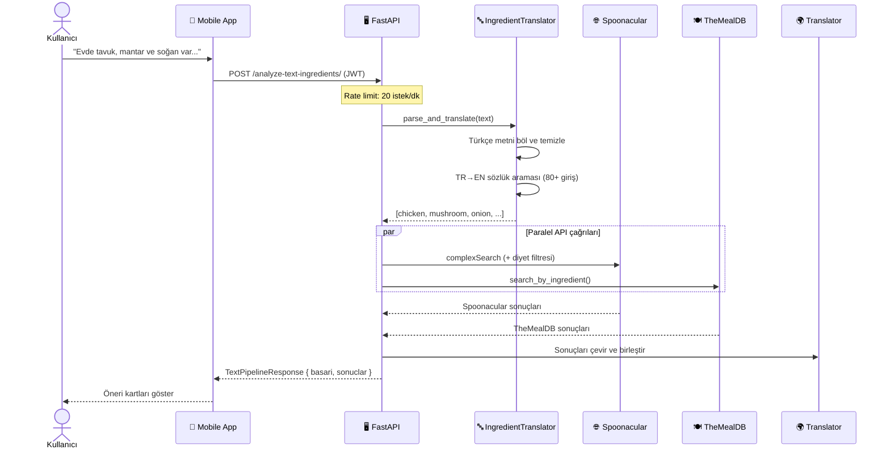

### 2c. Hibrit Pipeline (Pipeline 3 — Çevrimdışı Destekli)

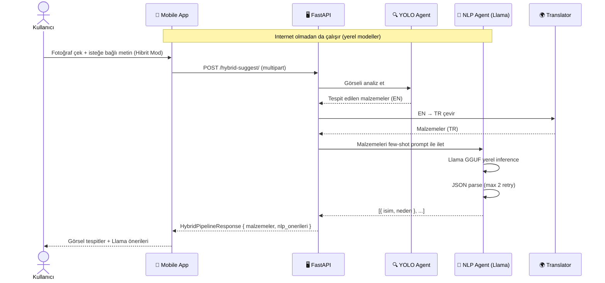

---

## 3. Kimlik Doğrulama Akışı

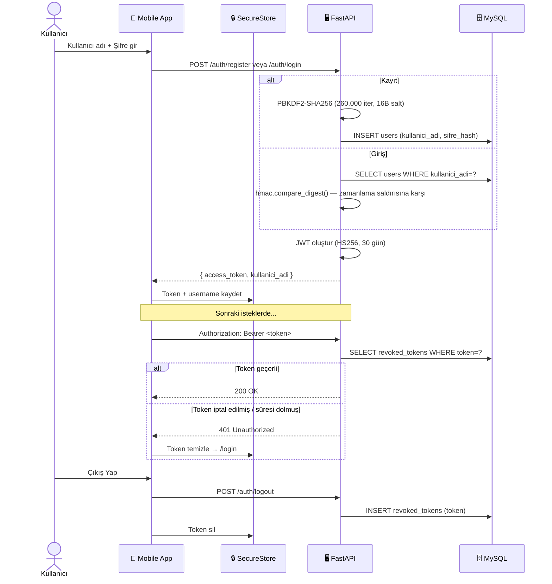

---

## 4. Veritabanı ER Diyagramı

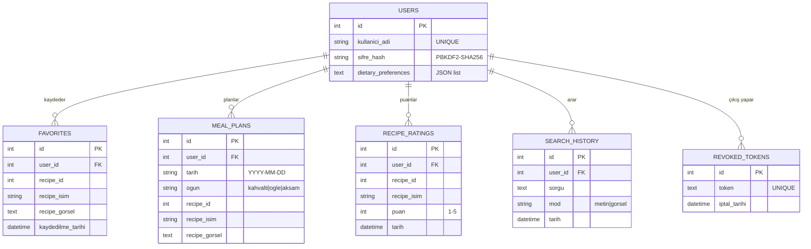

---

## 5. Kullanıcı Akışı (User Flow)

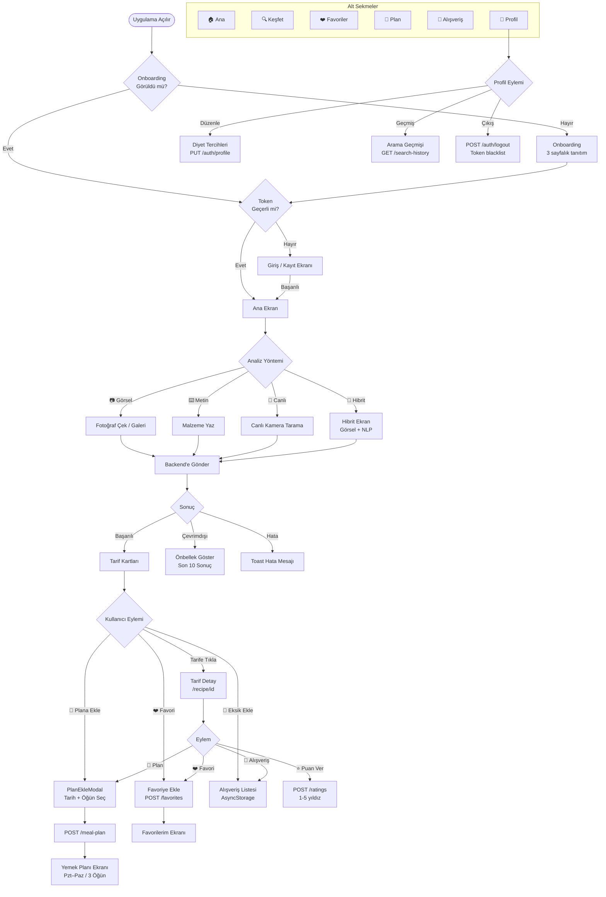

---

## 6. API Endpoint Haritası

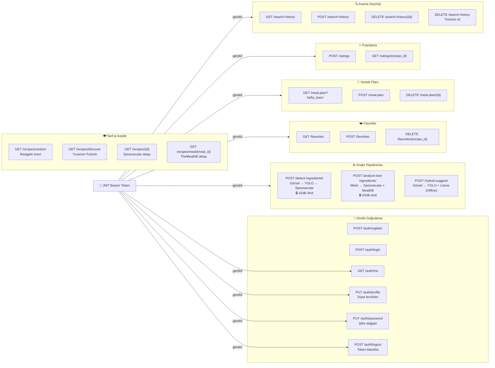

---

## 7. Mobile Uygulama Mimarisi

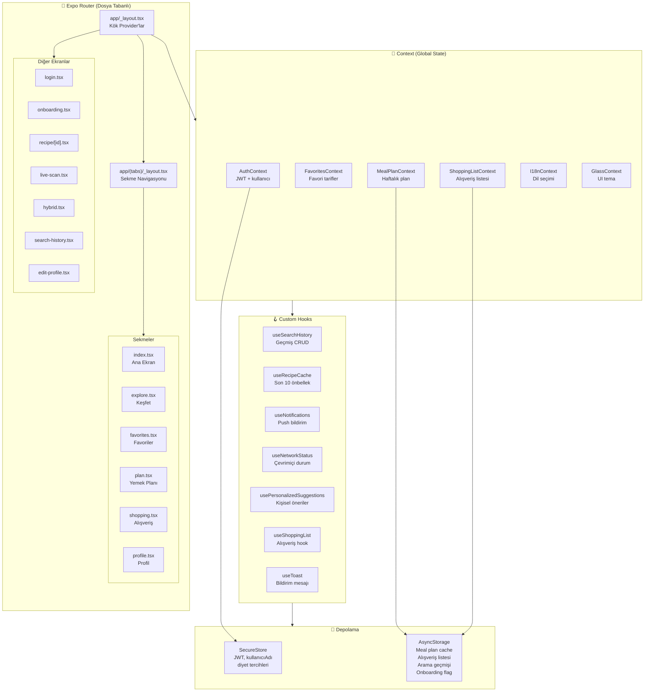

---

## 8. Özellikler Haritası

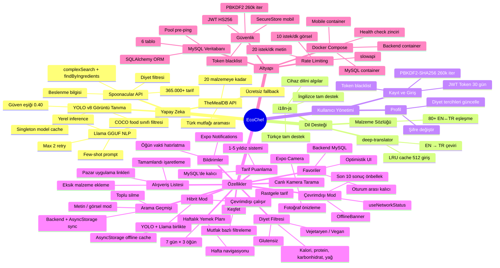

---

## 9. Teknoloji Yığını

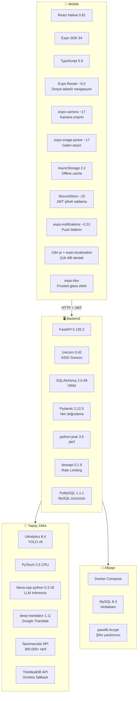

---

## 10. Backend Dosya Yapısı

```mermaid
graph TD
    BE["backend/"]

    BE --> MAIN["main.py\n42 endpoint, CORS, rate limit"]
    BE --> REQ["requirements.txt\nPinlenmiş bağımlılıklar"]
    BE --> DOCK["Dockerfile\nPython 3.12 slim"]

    BE --> CORE["core/"]
    CORE --> CFG["config.py\nPydantic Settings"]
    CORE --> DB["database.py\n6 SQLAlchemy modeli"]
    CORE --> AUT["auth.py\nJWT + PBKDF2"]
    CORE --> ORC["orchestrator.py\n3 pipeline"]
    CORE --> IT["ingredient_translator.py\nEN↔TR sözlük"]
    CORE --> TR["translator.py\nLRU cache çeviri"]
    CORE --> LOG["logger.py\nHiyerarşik log"]
    CORE --> RC["request_context.py\nContextVar"]

    BE --> AGENTS["agents/"]
    AGENTS --> VA["vision_agent.py\nYOLO singleton"]
    AGENTS --> NA["nlp_agent.py\nLlama GGUF"]

    BE --> CONN["connectors/"]
    CONN --> SP["spoonacular.py\nAna API"]
    CONN --> MD["themealdb.py\nFallback API"]

    BE --> SCH["schemas/"]
    SCH --> RS["recipe.py"]
    SCH --> IS["ingredient.py"]
    SCH --> US["user.py"]
    SCH --> RE["response.py"]
```

---

## 11. Mobile Dosya Yapısı

```mermaid
graph TD
    MOB["mobile/"]

    MOB --> AJ["app.json\nExpo config"]
    MOB --> PJ["package.json\nNPM bağımlılıklar"]
    MOB --> MDOCK["Dockerfile\nNode 20 slim"]

    MOB --> APP["app/"]
    APP --> ROOT_LAY["_layout.tsx\nKök layout + providers"]
    APP --> TABS_DIR["(tabs)/"]
    TABS_DIR --> TAB_LAY["_layout.tsx\nSekme navigasyonu"]
    TABS_DIR --> IDX["index.tsx — Ana"]
    TABS_DIR --> EXP["explore.tsx — Keşfet"]
    TABS_DIR --> FAV["favorites.tsx — Favoriler"]
    TABS_DIR --> PLN["plan.tsx — Yemek Planı"]
    TABS_DIR --> SHP["shopping.tsx — Alışveriş"]
    TABS_DIR --> PRF["profile.tsx — Profil"]
    APP --> RCP["recipe/[id].tsx\nDinamik tarif detayı"]
    APP --> LGN["login.tsx"]
    APP --> ONBRD["onboarding.tsx"]
    APP --> LSCN["live-scan.tsx"]
    APP --> HYB["hybrid.tsx"]
    APP --> SRCH["search-history.tsx"]
    APP --> EDTP["edit-profile.tsx"]

    MOB --> CTX["context/"]
    CTX --> AC["AuthContext.tsx"]
    CTX --> FC["FavoritesContext.tsx"]
    CTX --> MC["MealPlanContext.tsx"]
    CTX --> SC["ShoppingListContext.tsx"]
    CTX --> IC["I18nContext.tsx"]
    CTX --> GC["GlassContext.tsx"]

    MOB --> HKS["hooks/"]
    HKS --> HSH["use-search-history.ts"]
    HKS --> HRC["use-recipe-cache.ts"]
    HKS --> HNT["use-notifications.ts"]
    HKS --> HNS["use-network-status.ts"]
    HKS --> HPS["use-personalized-suggestions.ts"]
    HKS --> HSL["use-shopping-list.ts"]
    HKS --> HT["use-toast.ts"]

    MOB --> COMP["components/"]
    COMP --> TST["Toast.tsx"]
    COMP --> OFB["OfflineBanner.tsx"]
    COMP --> GSC["GlassScreen.tsx"]
    COMP --> RSK["RecipeSkeleton.tsx"]
    COMP --> PEM["PlanEkleModal.tsx"]
    COMP --> ANB["AnimatedButton.tsx"]
    COMP --> GC2["GlassCard.tsx"]

    MOB --> LOC["locales/"]
    LOC --> TR_J["tr.json — 1000+ anahtar"]
    LOC --> EN_J["en.json — 1000+ anahtar"]

    MOB --> UTILS["utils/"]
    UTILS --> API_U["api.ts — BASE_URL, header, mapper"]

    MOB --> CONST["constants/"]
    CONST --> THM["theme.ts — Renkler"]
    CONST --> GLS["glass.ts — Blur sabitler"]
```
